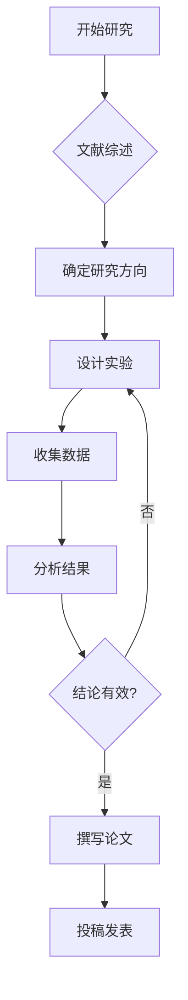

## 简介

Markdown 是一种轻量级标记语言，广泛用于技术写作、博客发布和学术笔记。本文将介绍本站支持的 Markdown 常用功能。

---

## 基本语法

### 文本格式

- **加粗文本** 使用双星号
- *斜体文本* 使用单星号
- ~~删除线~~ 使用双波浪线
- `行内代码` 使用反引号

### 链接与图片

[访问 GitHub](https://github.com/Road1228)

{: width="800" height="400" }
_图片说明文字_

---

## 代码高亮

支持多种编程语言的语法高亮：

```python
import numpy as np
import matplotlib.pyplot as plt

def hello_world():
    """一个简单的示例函数"""
    x = np.linspace(0, 2 * np.pi, 100)
    y = np.sin(x)
    plt.plot(x, y)
    plt.title("Sine Wave")
    plt.show()

if __name__ == "__main__":
    hello_world()
```

```bash
# 终端命令示例
echo "Hello, World!"
git status
bundle exec jekyll serve
```

---

## 数学公式

行内公式：$E = mc^2$

块级公式：

$$
\mathcal{L}(\theta) = -\frac{1}{N} \sum_{i=1}^{N} \left[ y_i \log(\hat{y}_i) + (1 - y_i) \log(1 - \hat{y}_i) \right]
$$

贝叶斯定理：

$$
P(A|B) = \frac{P(B|A) \cdot P(A)}{P(B)}
$$

---

## 表格

| 特性 | 支持情况 | 说明 |
|:-----|:--------:|-----:|
| 代码高亮 | 是 | 支持多种语言 |
| 数学公式 | 是 | 使用 MathJax |
| Mermaid 图表 | 是 | 流程图等 |
| 图片 | 是 | 本地或远程 |

---

## Mermaid 流程图



---

## 提示框

> 这是默认引用块
{: .prompt-info }

> 这是一个提示
{: .prompt-tip }

> 注意事项
{: .prompt-warning }

> 危险操作
{: .prompt-danger }

---

## 总结

本站基于 Jekyll + Chirpy 主题，支持丰富的 Markdown 扩展功能，非常适合学术笔记和技术写作。
