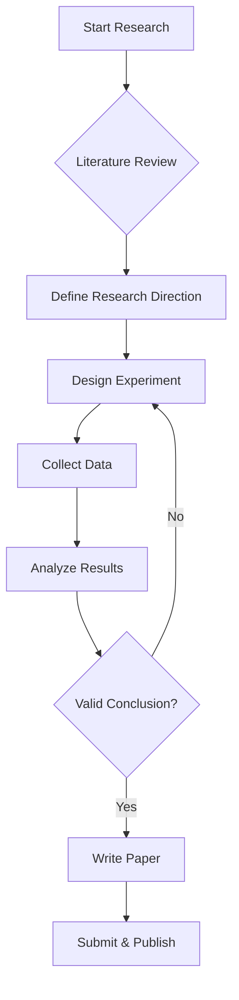

## Introduction

Markdown is a lightweight markup language widely used for technical writing, blogging, and academic notes. This post introduces the common Markdown features supported by this site.

---

## Basic Syntax

### Text Formatting

- **Bold text** using double asterisks
- *Italic text* using single asterisks
- ~~Strikethrough~~ using double tildes
- `Inline code` using backticks

### Links & Images

[Visit GitHub](https://github.com/Road1228)

{: width="800" height="400" }
_Image caption_

---

## Code Highlighting

Syntax highlighting for multiple programming languages is supported:

```python
import numpy as np
import matplotlib.pyplot as plt

def hello_world():
    """A simple example function"""
    x = np.linspace(0, 2 * np.pi, 100)
    y = np.sin(x)
    plt.plot(x, y)
    plt.title("Sine Wave")
    plt.show()

if __name__ == "__main__":
    hello_world()
```

```bash
# Terminal command examples
echo "Hello, World!"
git status
bundle exec jekyll serve
```

---

## Math Formulas

Inline formula: $E = mc^2$

Block formula:

$$
\mathcal{L}(\theta) = -\frac{1}{N} \sum_{i=1}^{N} \left[ y_i \log(\hat{y}_i) + (1 - y_i) \log(1 - \hat{y}_i) \right]
$$

Bayes' theorem:

$$
P(A|B) = \frac{P(B|A) \cdot P(A)}{P(B)}
$$

---

## Tables

| Feature | Supported | Notes |
|:--------|:---------:|------:|
| Code Highlighting | Yes | Multiple languages |
| Math Formulas | Yes | MathJax |
| Mermaid Diagrams | Yes | Flowcharts, etc. |
| Images | Yes | Local or remote |

---

## Mermaid Flowchart



---

## Prompt Boxes

> This is a default blockquote
{: .prompt-info }

> This is a tip
{: .prompt-tip }

> Warning note
{: .prompt-warning }

> Danger action
{: .prompt-danger }

---

## Summary

This site is built with Jekyll + Chirpy theme, supporting rich Markdown extensions, ideal for academic notes and technical writing.
